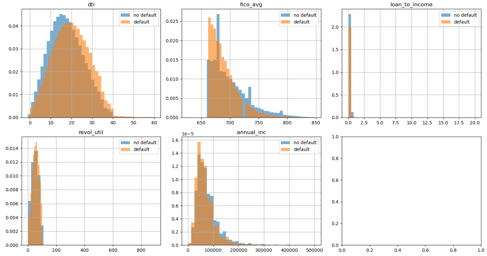
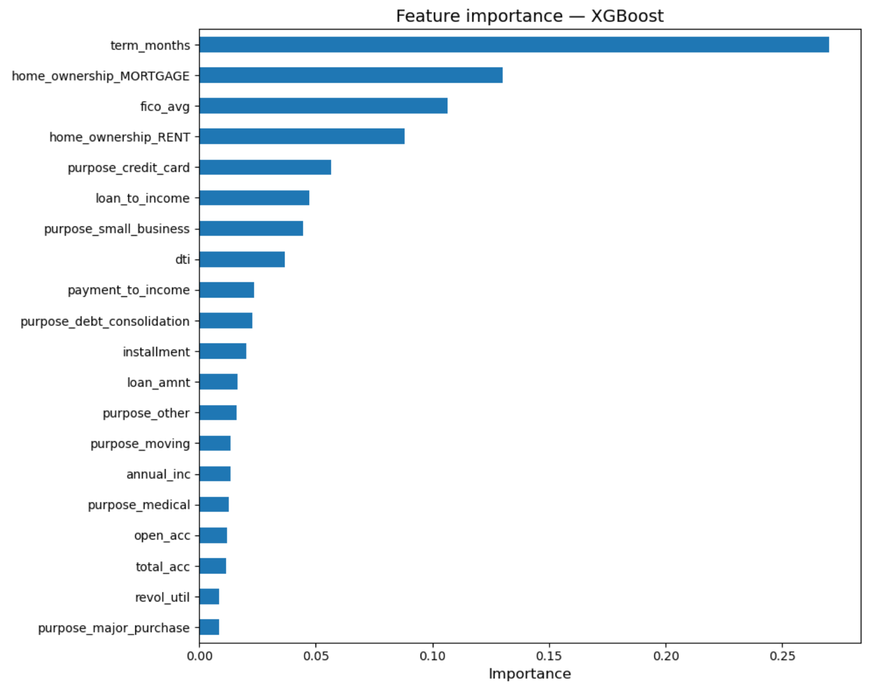
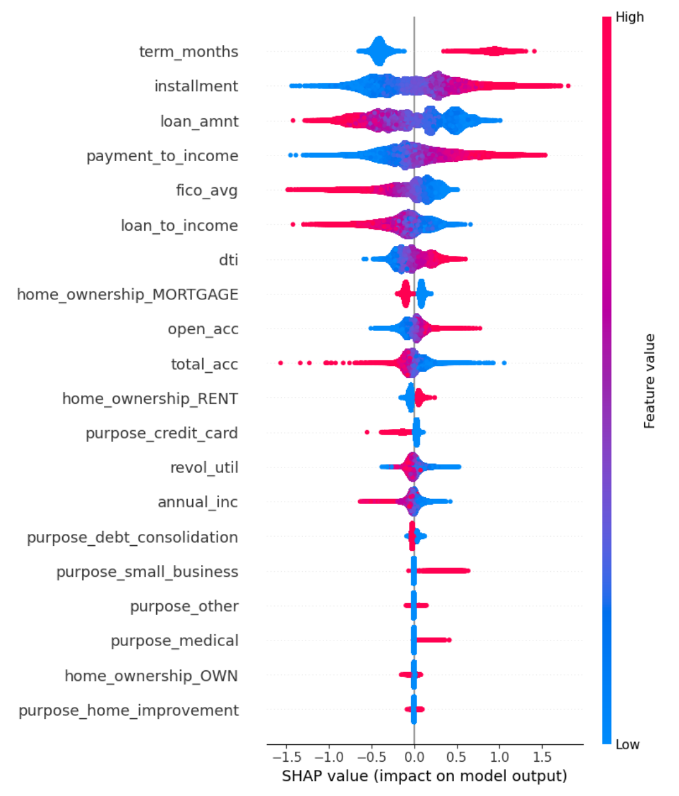
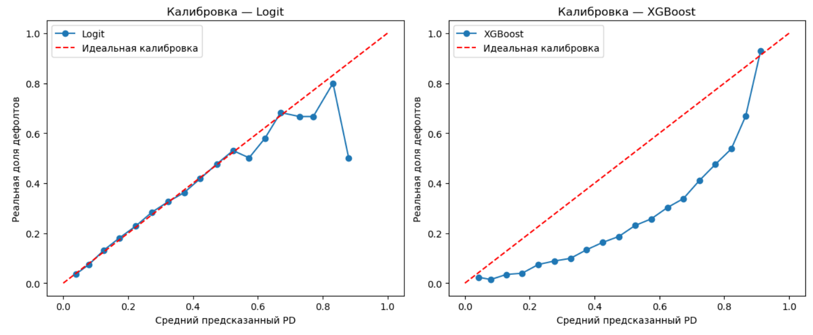
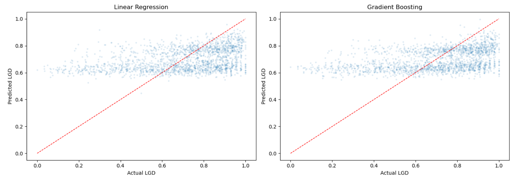
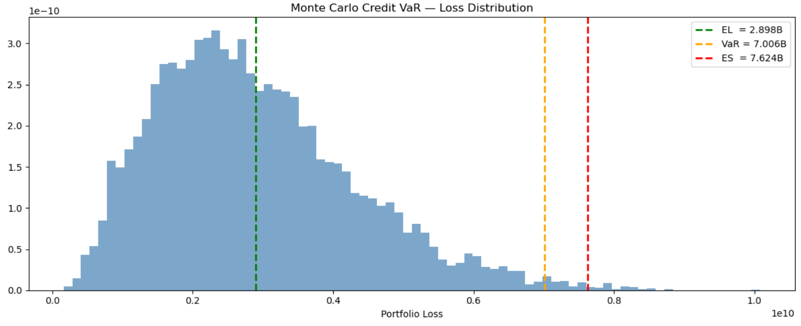
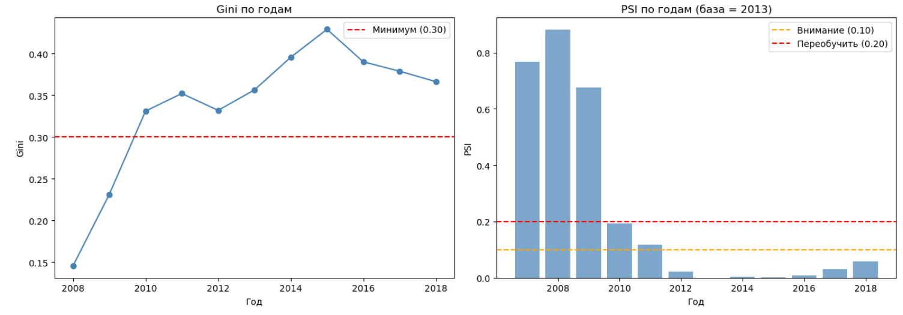
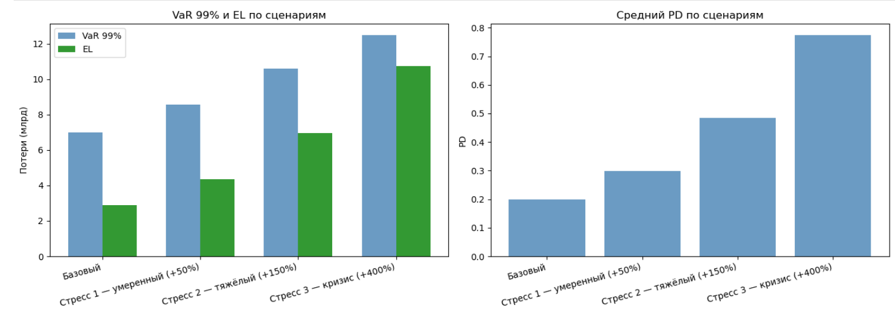

# Credit Risk Pipeline

End-to-end пайплайн количественного моделирования кредитного риска на данных Lending Club.

## Что делает проект
Берёт портфель потребительских кредитов и отвечает на три вопроса:
1. Рассчет вероятности дефолта с помощью PD-модели на осннове Logit-регрессии
2. Оценка LGD банка
3. Рассчет VaR и ES и стресс-тестирование

## Стек
Python · DuckDB · XGBoost · Scikit-learn · MLflow · Statsmodels

## Ключевые результаты
| Метрика | Значение |
|---------|---------|
| AUC PD модели | 0.71 |
| Gini PD модели | 0.42 |
| Портфельный EL | $2.90B |
| Credit VaR 99% (ASRF) | $7.01B |
| VaR / EAD | 0.363 |

## Структура проекта

```
risk-project/
├── data/                   # не отслеживается git
├── notebooks/
│   ├── 00_data.ipynb           # загрузка данных, SQL пайплайн
│   ├── 01_eda.ipynb            # разведочный анализ данных
│   ├── 02_pd_model.ipynb       # PD модели + MLflow
│   ├── 03_lgd_model.ipynb      # LGD модель
│   ├── 04_credit_var.ipynb     # Monte Carlo Credit VaR
│   ├── 05_backtest.ipynb       # бэктест модели
│   └── 06_stress_test.ipynb    # стресс-тестирование
├── sql/
│   ├── 01_raw.sql              # загрузка сырых данных
│   ├── 02_staging.sql          # чистка и таргет
│   └── 03_mart.sql             # витрина фич
├── models/ 
└── src/
```

## Методология

### SQL Data Warehouse
Трёхслойная архитектура (raw → staging → mart) на DuckDB.
Сырые данные Lending Club (2.3 млн кредитов) отфильтрованы
до завершённых кредитов (Fully Paid / Charged Off / Default):
1.34 млн наблюдений. Доля дефолтов в выборке 20%.

### Разведочный анализ


### PD модель
PD строилась двумя методами:
- Logit-регрессия: Gini 0.41, AUC 0.71
- XGBoost: Gini 0.42, AUC 0.71




Для финального пайплайна выбрана логистическая регрессия -
средний предсказанный PD 0.200 совпадает с реальной долей дефолтов 0.200.



### LGD модель
Средний LGD = 0.697. Линейная регрессия и Градиентный бустинг
дали R²~0.15, поэтому для дальнейшего анализа был
использован pooled LGD = 0.697
согласно подходу Базель II для розничных экспозиций.




### Credit VaR
Monte Carlo симуляция (10 000 прогонов) по модели ASRF (Базель II):
- Систематический фактор ρ = 0.15
- Порог дефолта: K = Φ⁻¹(PD)
- Стоимость активов: Y = √ρ·Z + √(1-ρ)·ε
- Дефолт если Y < K



| Метрика | Значение |
|---------|---------|
| EL | $2.90B (15.0% от EAD) |
| VaR 99% | $7.01B (36.3% от EAD) |
| ES 99% | $7.62B |
| Unexpected Loss | $4.11B |

### Бэктест
- PSI стабилен (< 0.10) для когорт 2012–2018
- Данные до 2011 года исключены: PSI > 0.20 указывает на смену популяции (финансовый кризис и начало развития Landing Club)
- Биномиальный тест показывает систематическое завышение PD в 2013–2014 и занижение в 2016–2017



### Стресс-тест
Построена ADL макромодель (default_rate ~ собственные лаги + ставка ФРС),
однако коэффициент при ставке показал контринтуитивный знак из-за специфики
роста Lending Club в период низких ставок 2008–2015.
Использован прямой сценарный анализ:



| Сценарий | PD | EL | VaR 99% | VaR/EAD |
|----------|----|----|---------|---------|
| Базовый | 0.200 | $2.90B | $7.01B | 0.363 |
| Стресс 1 +50% | 0.299 | $4.34B | $8.57B | 0.444 |
| Стресс 2 +150% | 0.484 | $6.96B | $10.60B | 0.549 |
| Кризис +400% | 0.775 | $10.73B | $12.50B | 0.648 |

*Стресс применяется как умножение индивидуальных PD каждого заёмщика
на коэффициент сценария с ограничением PD ∈ [0.001, 0.999].
Средний PD портфеля отличается от теоретического значения (например
0.484 вместо 0.500 при ×2.5) из-за усечения хвоста распределения -
часть заёмщиков с высоким базовым PD достигает верхней границы.*

## Как воспроизвести
```bash
pip install -r requirements.txt

# 1. Скачать датасет Lending Club с Kaggle
#    Положить accepted_2007_to_2018Q4.csv в папку data/

# 2. Запустить ноутбуки по порядку
jupyter notebook notebooks/00_data.ipynb
# ... до 06_stress_test.ipynb

# 3. Просмотр экспериментов MLflow
mlflow ui --backend-store-uri sqlite:///mlflow.db
```

## Основные выводы
- Логистическая регрессия не уступает XGBoost при исключении data leakage
- LGD практически константен для необеспеченных кредитов (R²=0.15) — pooled estimate достаточен
- Учёт корреляции дефолтов через ASRF (ρ=0.15) повышает VaR с $2.9B до $7.0B
- Модель стабильна на данных 2012–2018, требует рекалибровки для докризисных когорт
- ADL макромодель выявила ограничения использования ставки ФРС как эндогенного предиктора на данных быстрорастущей платформы
